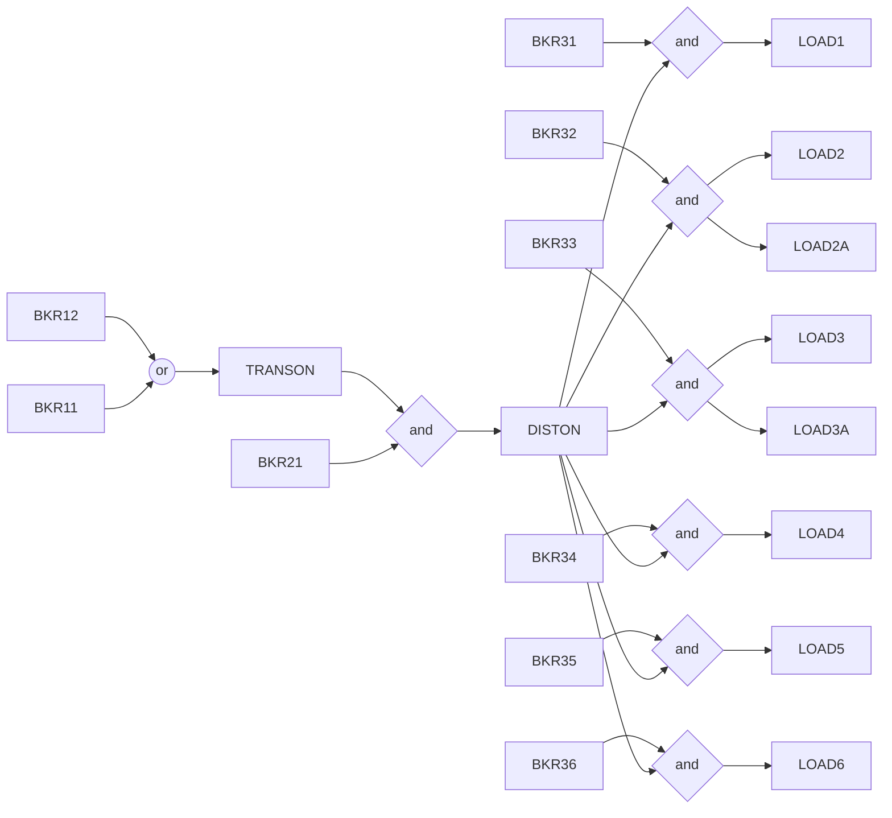

# PLC Flowcharts

## Substation (`107890.st`)

```mermaid

flowchart LR

BKR12 --> o1((or)) --> TRANSON --> a1
BKR11 --> o1
BKR21 --> a1{and} --> DISTON

BKR31 --> a2{and} --> LOAD1
DISTON --> a2
BKR32 --> a3{and} --> LOAD2
DISTON --> a3 --> LOAD2A
BKR33 --> a4{and} --> LOAD3
DISTON --> a4 --> LOAD3A
BKR34 --> a5{and} --> LOAD4
DISTON --> a5
BKR35 --> a6{and} --> LOAD5
DISTON --> a6
BKR36 --> a7{and} --> LOAD6
DISTON --> a7

```

## ?? (`406635.st`)

```mermaid

flowchart LR

Green_Light_NS
Yellow_Light_NS
Red_Light_NS
Green_Light_EW
Yellow_Light_EW
Red_Light_EW
Green_Pulse_NS
Power_In
Green_Release_NS
Yellow_Pulse_NS
Yellow_Release_NS
Green_Release_EW
Green_Pulse_EW
Yellow_Release_EW
Yellow_Pulse_EW
Green_Timer_NS
Yellow_Timer_NS
Green_Timer_EW
Yellow_Timer_EW

F_TRIG0
F_TRIG2
Green_Delay_NS
Green_Delay_EW
Second_Pulse_Green_NS
Second_Pulse_Yellow_NS
Second_Pulse_Green_EW
Second_Pulse_Yellow_EW
Green_Count_NS
Yellow_Count_NS
Green_Count_EW
Yellow_Count_EW

Blink_Red_NS
Blink_Red_NS_1
Blink_Red_NS_2

Blink_Timer_1
Blink_Timer_2

Blink_Red_EW
Blink_Red_EW1
Blink_Red_EW2

Blink_Timer_3
Blink_Timer_4

Blink_Red_All
Blink_Red_All1
Blink_Red_All2

Blink_Timer_5
Blink_Timer_6

Blink_Yellow_All
Blink_Yellow_All1
Blink_Yellow_All2

Blink_Timer_7
Blink_Timer_8

Green_Light_NS_1
Yellow_Light_NS_1
Yellow_Light_NS_2
Yellow_Light_NS_3
Red_Light_NS_1
Red_Light_NS_2
Red_Light_NS_3
Green_Light_EW_1
Yellow_Light_EW_1
Yellow_Light_EW_2
Yellow_Light_EW_3
Red_Light_EW_1
Red_Light_EW_2
Red_Light_EW_3
TEST_ALL
RUN


```

## Traffic_Light (`706957.st`)

```mermaid


```

## ?? (`692121.st`)

```mermaid


```