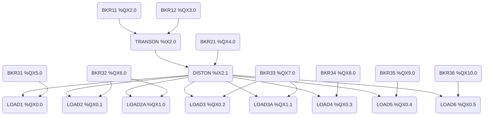
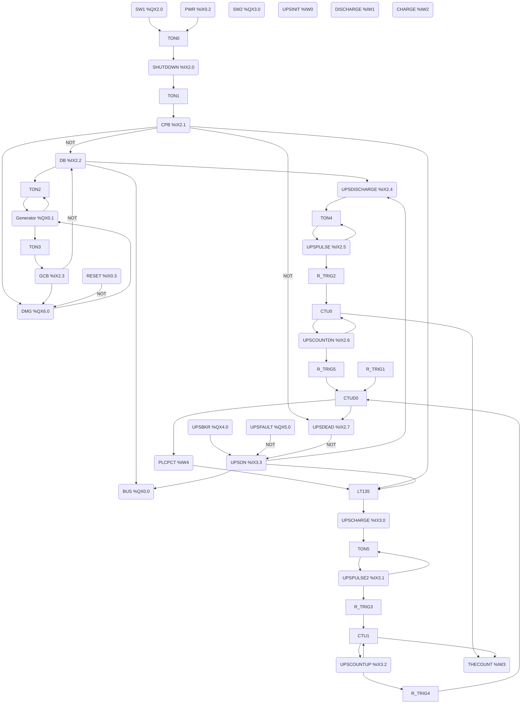
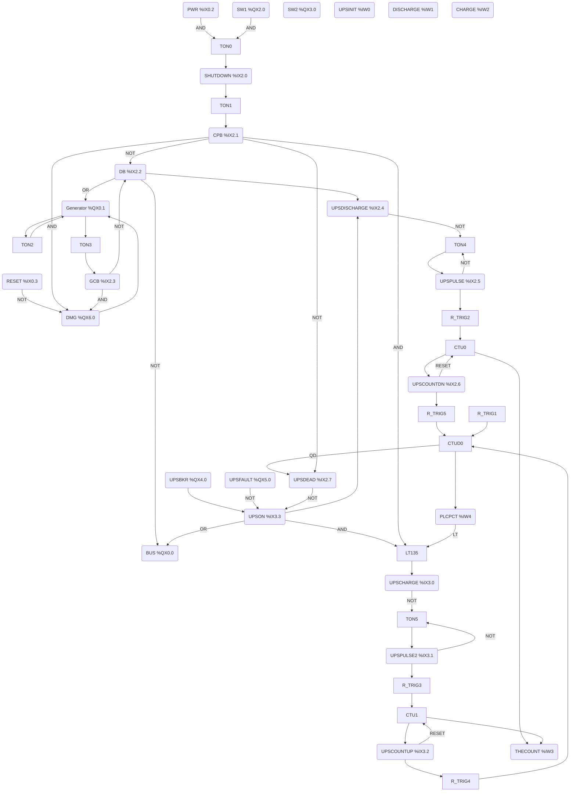
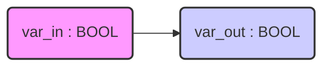

# ST Flowcharts

## 107890.st

```mermaid
graph TD
    BKR11("BKR11 %QX2.0")
    BKR12("BKR12 %QX3.0")
    BKR21("BKR21 %QX4.0")
    BKR31("BKR31 %QX5.0")
    BKR32("BKR32 %QX6.0")
    BKR33("BKR33 %QX7.0")
    BKR34("BKR34 %QX8.0")
    BKR35("BKR35 %QX9.0")
    BKR36("BKR36 %QX10.0")
    TRANSON("TRANSON %IX2.0")
    DISTON("DISTON %IX2.1")
    LOAD1("LOAD1 %QX0.0")
    LOAD2("LOAD2 %QX0.1")
    LOAD2A("LOAD2A %QX1.0")
    LOAD3("LOAD3 %QX0.2")
    LOAD3A("LOAD3A %QX1.1")
    LOAD4("LOAD4 %QX0.3")
    LOAD5("LOAD5 %QX0.4")
    LOAD6("LOAD6 %QX0.5")

    BKR11 --> TRANSON
    BKR12 --> TRANSON
    TRANSON --> DISTON
    BKR21 --> DISTON
    DISTON --> LOAD1
    DISTON --> LOAD2
    DISTON --> LOAD2A
    DISTON --> LOAD3
    DISTON --> LOAD3A
    DISTON --> LOAD4
    DISTON --> LOAD5
    DISTON --> LOAD6

    BKR31 --> LOAD1
    BKR32 --> LOAD2
    BKR32 --> LOAD2A
    BKR33 --> LOAD3
    BKR33 --> LOAD3A
    BKR34 --> LOAD4
    BKR35 --> LOAD5
    BKR36 --> LOAD6
```

## 406635.st

```mermaid
graph TD
    PWR("PWR %IX0.2")
    RESET("RESET %IX0.3")
    BUS("BUS %QX0.0")
    Generator("Generator %QX0.1")
    SW1("SW1 %QX2.0")
    SW2("SW2 %QX3.0")
    UPSBKR("UPSBKR %QX4.0")
    UPSFAULT("UPSFAULT %QX5.0")
    DMG("DMG %QX6.0")
    SHUTDOWN("SHUTDOWN %IX2.0")
    CPB("CPB %IX2.1")
    DB("DB %IX2.2")
    GCB("GCB %IX2.3")
    UPSDISCHARGE("UPSDISCHARGE %IX2.4")
    UPSPULSE("UPSPULSE %IX2.5")
    UPSCOUNTDN("UPSCOUNTDN %IX2.6")
    UPSDEAD("UPSDEAD %IX2.7")
    UPSCHARGE("UPSCHARGE %IX3.0")
    UPSPULSE2("UPSPULSE2 %IX3.1")
    UPSCOUNTUP("UPSCOUNTUP %IX3.2")
    UPSON("UPSON %IX3.3")
    UPSINIT("UPSINIT %IW0")
    DISCHARGE("DISCHARGE %IW1")
    CHARGE("CHARGE %IW2")
    THECOUNT("THECOUNT %IW3")
    PLCPCT("PLCPCT %IW4")

    CPB -->|NOT| DB
    GCB -->|NOT| DB
    DB --> BUS
    UPSON --> BUS
    SW1 --> TON0
    PWR --> TON0
    TON0 --> SHUTDOWN
    SHUTDOWN --> TON1
    TON1 --> CPB
    DB --> TON2
    Generator --> TON2
    TON2 --> Generator
    Generator --> TON3
    TON3 --> GCB
    CPB --> DMG
    GCB --> DMG
    RESET -->|NOT| DMG
    DMG --> Generator
    UPSBKR --> UPSON
    UPSFAULT -->|NOT| UPSON
    UPSDEAD -->|NOT| UPSON
    UPSON --> UPSDISCHARGE
    DB --> UPSDISCHARGE
    UPSPULSE --> R_TRIG2
    R_TRIG2 --> CTU0
    UPSCOUNTDN --> CTU0
    CTU0 --> UPSCOUNTDN
    CTU0 --> THECOUNT
    PLCPCT --> LT135
    CPB --> LT135
    UPSON --> LT135
    LT135 --> UPSCHARGE
    UPSPULSE2 --> R_TRIG3
    R_TRIG3 --> CTU1
    UPSCOUNTUP --> CTU1
    CTU1 --> UPSCOUNTUP
    CTU1 --> THECOUNT
    UPSCOUNTUP --> R_TRIG4
    UPSCOUNTDN --> R_TRIG5
    R_TRIG4 --> CTUD0
    R_TRIG5 --> CTUD0
    R_TRIG1 --> CTUD0
    CTUD0 --> PLCPCT
    CPB -->|NOT| UPSDEAD
    CTUD0 --> UPSDEAD
    UPSPULSE --> TON4
    UPSDISCHARGE --> TON4
    TON4 --> UPSPULSE
    UPSPULSE2 --> TON5
    UPSCHARGE --> TON5
    TON5 --> UPSPULSE2
```

## 692121.st

```mermaid
graph TD
    PWR("PWR %IX0.2")
    RESET("RESET %IX0.3")
    BUS("BUS %QX0.0")
    Generator("Generator %QX0.1")
    SW1("SW1 %QX2.0")
    SW2("SW2 %QX3.0")
    UPSBKR("UPSBKR %QX4.0")
    UPSFAULT("UPSFAULT %QX5.0")
    DMG("DMG %QX6.0")
    SHUTDOWN("SHUTDOWN %IX2.0")
    CPB("CPB %IX2.1")
    DB("DB %IX2.2")
    GCB("GCB %IX2.3")
    UPSDISCHARGE("UPSDISCHARGE %IX2.4")
    UPSPULSE("UPSPULSE %IX2.5")
    UPSCOUNTDN("UPSCOUNTDN %IX2.6")
    UPSDEAD("UPSDEAD %IX2.7")
    UPSCHARGE("UPSCHARGE %IX3.0")
    UPSPULSE2("UPSPULSE2 %IX3.1")
    UPSCOUNTUP("UPSCOUNTUP %IX3.2")
    UPSON("UPSON %IX3.3")
    UPSINIT("UPSINIT %IW0")
    DISCHARGE("DISCHARGE %IW1")
    CHARGE("CHARGE %IW2")
    THECOUNT("THECOUNT %IW3")
    PLCPCT("PLCPCT %IW4")

    PWR -->|AND| TON0
    SW1 -->|AND| TON0
    TON0 --> SHUTDOWN
    SHUTDOWN --> TON1
    TON1 --> CPB
    CPB -->|NOT| DB
    GCB -->|NOT| DB
    DB -->|OR| Generator
    Generator --> TON2
    TON2 --> Generator
    Generator --> TON3
    TON3 --> GCB
    DMG --> Generator
    RESET -->|NOT| DMG
    CPB -->|AND| DMG
    GCB -->|AND| DMG
    UPSBKR --> UPSON
    UPSFAULT -->|NOT| UPSON
    UPSDEAD -->|NOT| UPSON
    UPSON --> UPSDISCHARGE
    DB --> UPSDISCHARGE
    UPSDISCHARGE -->|NOT| TON4
    UPSPULSE -->|NOT| TON4
    TON4 --> UPSPULSE
    UPSPULSE --> R_TRIG2
    R_TRIG2 --> CTU0
    UPSCOUNTDN -->|RESET| CTU0
    CTU0 --> UPSCOUNTDN
    CTU0 --> THECOUNT
    UPSON -->|AND| LT135
    CPB -->|AND| LT135
    PLCPCT -->|LT| LT135
    LT135 --> UPSCHARGE
    UPSPULSE2 -->|NOT| TON5
    UPSCHARGE -->|NOT| TON5
    TON5 --> UPSPULSE2
    UPSPULSE2 --> R_TRIG3
    R_TRIG3 --> CTU1
    UPSCOUNTUP -->|RESET| CTU1
    CTU1 --> UPSCOUNTUP
    CTU1 --> THECOUNT
    UPSCOUNTUP --> R_TRIG4
    UPSCOUNTDN --> R_TRIG5
    R_TRIG4 --> CTUD0
    R_TRIG5 --> CTUD0
    R_TRIG1 --> CTUD0
    CTUD0 --> PLCPCT
    CTUD0 -->|QD| UPSDEAD
    CPB -->|NOT| UPSDEAD
    DB -->|NOT| BUS
    UPSON -->|OR| BUS
```

## 706957.st

```mermaid
graph TD
    Power_In("Power In %IX0.2")
    Green_Light_NS("Green Light NS %QX0.0")
    Yellow_Light_NS("Yellow Light NS %QX0.1")
    Red_Light_NS("Red Light NS %QX0.2")
    Green_Light_EW("Green Light EW %QX0.3")
    Yellow_Light_EW("Yellow Light EW %QX0.4")
    Red_Light_EW("Red Light EW %QX0.5")
    Green_Release_NS("Green Release NS %IX2.1")
    Yellow_Release_NS("Yellow Release NS %IX2.3")
    Green_Release_EW("Green Release EW %IX2.4")
    Yellow_Release_EW("Yellow Release EW %IX2.6")
    TEST_ALL("TEST ALL %QX7.0")
    RUN("RUN %QX8.0")
    
    Red_Light_EW1 --> Green_Delay_NS
    Green_Delay_NS --> Green_Light_NS_1
    Green_Light_NS_1 --> Green_Light_NS
    Green_Light_NS_1 --> Second_Pulse_Green_NS
    Second_Pulse_Green_NS --> Green_Pulse_NS
    Green_Pulse_NS --> R_TRIG1
    R_TRIG1 --> Green_Count_NS
    Green_Count_NS --> Green_Release_NS
    
    Red_Light_NS_1 --> Green_Delay_EW
    Green_Delay_EW --> Green_Light_EW_1
    Green_Light_EW_1 --> Green_Light_EW
    Green_Light_EW_1 --> Second_Pulse_Green_EW
    Second_Pulse_Green_EW --> Green_Pulse_EW
    Green_Pulse_EW --> R_TRIG3
    R_TRIG3 --> Green_Count_EW
    Green_Count_EW --> Green_Release_EW
    
    Yellow_Light_NS_1 --> Second_Pulse_Yellow_NS
    Second_Pulse_Yellow_NS --> Yellow_Pulse_NS
    Yellow_Pulse_NS --> R_TRIG2
    R_TRIG2 --> Yellow_Count_NS
    Yellow_Count_NS --> Yellow_Release_NS
    Yellow_Release_NS --> Yellow_Light_NS
    
    Yellow_Light_EW_1 --> Second_Pulse_Yellow_EW
    Second_Pulse_Yellow_EW --> Yellow_Pulse_EW
    Yellow_Pulse_EW --> R_TRIG4
    R_TRIG4 --> Yellow_Count_EW
    Yellow_Count_EW --> Yellow_Release_EW
    Yellow_Release_EW --> Yellow_Light_EW
    
    Blink_Red_NS --> Blink_Timer_1
    Blink_Timer_1 --> Blink_Red_NS_1
    Blink_Red_NS_1 --> Blink_Timer_2
    Blink_Timer_2 --> Blink_Red_NS_2
    Blink_Red_NS_2 --> Red_Light_NS_2
    
    Blink_Red_EW --> Blink_Timer_3
    Blink_Timer_3 --> Blink_Red_EW1
    Blink_Red_EW1 --> Blink_Timer_4
    Blink_Timer_4 --> Blink_Red_EW2
    Blink_Red_EW2 --> Red_Light_EW_2
    
    Blink_Red_All --> Blink_Timer_5
    Blink_Timer_5 --> Blink_Red_All1
    Blink_Red_All1 --> Blink_Timer_6
    Blink_Timer_6 --> Blink_Red_All2
    Blink_Red_All2 --> Red_Light_EW_3
    Blink_Red_All2 --> Red_Light_NS_3
    
    Blink_Yellow_All --> Blink_Timer_7
    Blink_Timer_7 --> Blink_Yellow_All1
    Blink_Yellow_All1 --> Blink_Timer_8
    Blink_Timer_8 --> Blink_Yellow_All2
    Blink_Yellow_All2 --> Yellow_Light_EW_3
    Blink_Yellow_All2 --> Yellow_Light_NS_3
    
    Power_In --> Green_Light_NS
    Power_In --> Yellow_Light_NS
    Power_In --> Red_Light_NS
    Power_In --> Green_Light_EW
    Power_In --> Yellow_Light_EW
    Power_In --> Red_Light_EW
    TEST_ALL --> Green_Light_NS
    TEST_ALL --> Yellow_Light_NS
    TEST_ALL --> Red_Light_NS
    TEST_ALL --> Green_Light_EW
    TEST_ALL --> Yellow_Light_EW
    TEST_ALL --> Red_Light_EW
    RUN --> Green_Light_NS_1
    RUN --> Yellow_Light_NS_1
    RUN --> Red_Light_NS_1
    RUN --> Green_Light_EW_1
    RUN --> Yellow_Light_EW_1
    RUN --> Red_Light_EW_1
```

## blank_program.st

```mermaid
graph LR
    var_in("var_in : BOOL") --> var_out("var_out : BOOL")

style var_in fill:#f9f,stroke:#333,stroke-width:2px
style var_out fill:#ccf,stroke:#333,stroke-width:2px
```